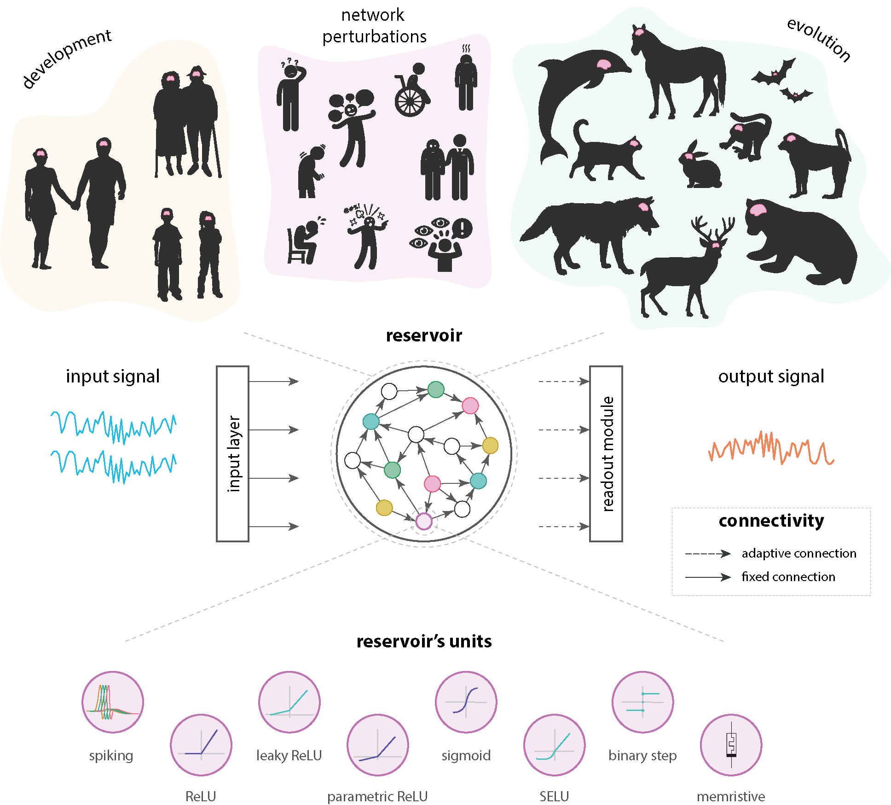
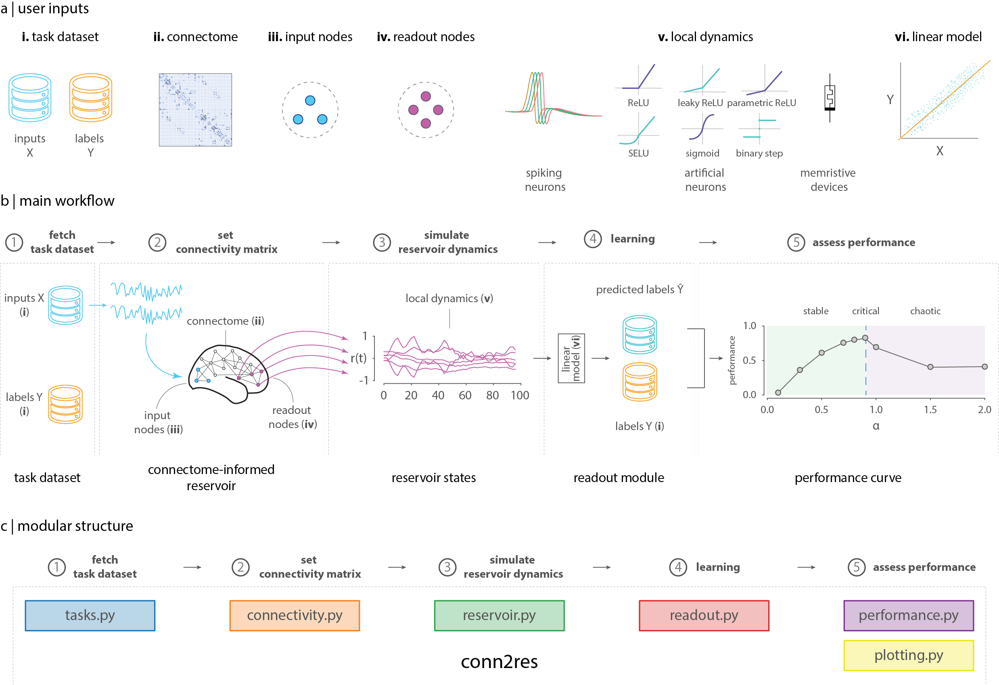

**Development Status:** 3 - Alpha. Some features still need to be added and tested.

conn2res
=========

The ``conn2res`` is a reservoir computing toolbox designed
for neuroscientes to train connectome-informed reservoirs
to perform different cognitive tasks.

The main advantage offered by the ``conn2res`` toolbox is its flexibility in
terms of the connectivity matrix used for the reservoir, the local dynamics
of the nodes, the possibility to select the set of input and output nodes, and
a diversity of neuroscience tasks provided by `NeuroGym <https://github.com/neurogym/neurogym>`__.

A brief primer on Reservoir Computing
-------------------------------------

Reservoir computing is a computational paradigm that uses artificial recurrent
neural networks (RNNs) to extract information from a continuous stream of
external stimuli and approximate complex time-varying functions
(Lukoševičius, M. and Jaeger, H, 2009).

The basic reservoir computing architecture consists of an input layer, followed
by the reservoir and a readout module. Typically, the reservoir is a randomly
connected RNN and the readout module a linear model. In contrast to traditional RNNs,
the connections of the reservoir are fixed; only the weights that connect the
reservoir to the readout module are trained, which correspond to the parameters of
the linear model. These weights are trained in a supervised manner to learn the
representations of the external stimuli constructed by the reservoir and can be
adapted to a wide range of tasks, including speech recognition, motor learning,
natural language processing, working memory and spatial navigation. Because
arbitrary network architecture and dynamics can be superimposed on the reservoir,
implementing biologically plausible network architectures allows to investigate
how brain network organization and dynamics jointly support learning.

conn2res: an overview
---------------------

The conn2res toolbox provides a general use-case driven workflow that takes as
input (1) either the type of task to be performed (see `NeuroGym
<https://github.com/neurogym/neurogym>`__), or a supervised dataset of input-
label pairs can also be provided; (2) a binary or weighted connectome, which
serves as the reservoir’s architecture; (3) the input nodes (i.e., nodes that
receive the external signal); (4) the readout nodes (i.e., nodes from which
information will be read and used to train the linear model); and (5) the type
of dynamics governing the activation of the reservoir’s units (continuous or
discrete time nonlinear dynamics can be implemented, including spiking neurons
or artificial neurons with different activation functions such as ReLU, leaky
ReLU, sigmoid or hyperbolic tangent). Depending on the type of dynamics, the
output is either a performance score, or a performance curve as a function of
the parameter that controls for the qualitative behavior of the reservoir’s
dynamics (i.e., stable, critical or chaotic).

The toolbox has been extended to simulate physical connectome-informed
memristive reservoirs, a newly type of neuromorphic hardware that, thanks to
its high computational and energy efficiency, has the potential to replace
conventional computer chips and revolutionize artificial intelligence algorithms
(Tanaka, G., et al., 2019).

Installation requirements
-------------------------

Currently, ``conn2res`` works with Python 3.8+ and requires a few
dependencies:

- numpy (>=1.21)
- pandas (>=1.3.4)
- mdp (>=3.6)
- scikit-learn (>=1.0)
- scipy (>=1.7)
- matplotlib (>=3.4)
- seaborn (>=0.11)
- neurogym

You can get started by installing ``conn2res`` from the source repository
with:

.. code-block:: bash

    git clone https://github.com/estefanysuarez/conn2res
    cd conn2res
    pip install .
